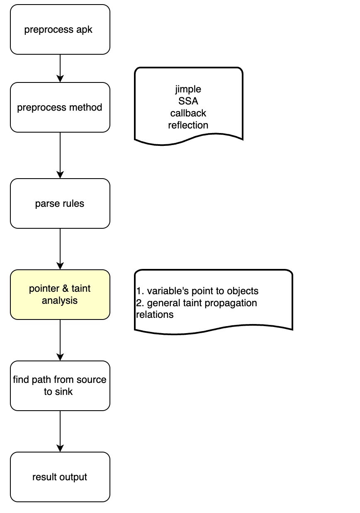

# Appshark introduction

Appshark is a static analysis tool for Android apps. Its goal is to analyze very large apps (Douyin currently has 1.5 million methods). Appshark supports the following features:

- JSON-based customized scanning rules to discover security vulnerabilities and privacy compliance issues you care about
- Flexible configuration -- you can trade off between accuracy and scanning time and space usage
- Custom extension rules to customize the analysis based on business needs

## Overview

Appshark is composed of modules: APK file processing, code preprocessing, user-defined rule analysis and analysis, pointer and data flow analysis, vulnerability identifying, sanitizer, and report generation. 
See the complete flowchart 

### APK file preprocessing

It mainly extracts the basic information of the app, such as exported components, manifest parsing, and discovering some common vulnerabilities in the manifest file. One of the most important tasks here is to use jadx to decompile the APK, and the generated java source code will be included in the final vulnerability details.

### Code preprocessing

There are three main functions of code preprocessing:

1. Generate SSA
2. Generate the basic call graph
3. Patch various Jimple statements according to the configuration, such as callback injection.

### User-defined rule parsing

The main function of this module is to translate the fuzzy user-defined rules into concrete sources and sinks, and then based on the user's rule configuration, to find the relevant analysis entry, and to generate the `TaintAnalyzer`. The so-called `TaintAnalyzer` is a combination of source, sink, and entry.

### Pointer and data flow analysis

The input of this module is mainly an entry method. It also contains a series of user-defined or system-preset analysis rules. Through a long-time pointer analysis, `AnalyzeContext` is generated. 
It contains the points-to and the data flow relationship obtained from the analysis starting from the specified entry.
The main idea of this module refers to the paper: [P/Taint: unified points-to and taint analysis](https://dl.acm.org/doi/10.1145/3133926)

### Vulnerability identifying 

The input of this module mainly uses three parts:

1. TaintAnalyzer: it finds the path from source to sink in the code
2. AnalyzeContext: it contains the data flow graph
3. Sanitizer in the association rules is used to filter out paths that do not meet the requirements.

This module will look for the path from source to sink according to the data flow graph provided by `AnalyzeContext`. If a path is found and not filtered by Sanitizer, it will be added as a vulnerability in the final result.

### Sanitizer

The function of this module is to filter out the paths that do not meet the requirements according to the user-defined sanitizer.

### Report generation module

Each vulnerability will be displayed in a user-readable form. It will also output a `result.json` file, which contains all the vulnerability information.