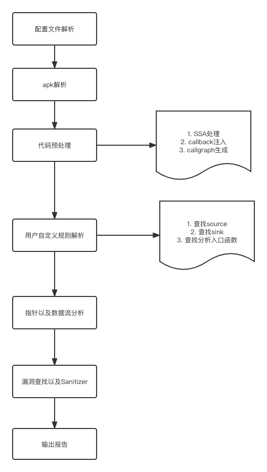

## 文档索引
- [1.概述](overview.md)
- [2.如何使用](startup.md)
- [3.规则撰写指南](how_to_write_rules.md)
- [4.如何使用appshark找出程序中的隐私合规问题](how_to_find_compliance_problem_use_appshark.md)
- [5.appshark深入教程](path_traversal_game.md)
- [6.参数配置](argument.md)
- [7.更深入的配置](EngineConfig.md)
- [8.报告格式](result.md)
- [9.常见问题](faq.md)

# Appshark 介绍

Appshark 是一个针对安卓的静态分析工具,它的设计目标是针对超大型App的分析(抖音目前已经有150万个函数). Appshark支持众多特性:

- 基于json的自定义扫描规则,发现自己关心的安全漏洞以及隐私合规问题
- 灵活配置,可以在准确率以及扫描时间空间之间寻求平衡
- 支持自定义扩展规则,根据自己的业务需要,进行定制分析

## 结构

Appshark有apk文件处理,代码预处理, 用户自定义规则分析解析,指针以及数据流分析,漏洞查找, sanitizer以及报告生成等模块组成.
完整的流程图见
 

### apk文件预处理

主要是提取app中的基本信息,比如导出组件,manifest解析,以及发现一些manifest中常见的漏洞. 这里面还有一个最重要的工作就是会使用jadx对apk进行反编译,其生成的java源码会在最后的漏洞详情中展示.

### 代码预处理

代码预处理最主要有三个功能:

1. 生成SSA
2. 生成基本的call graph
3. 根据配置进行各种指令的patch,比如callback注入.

### 用户自定义规则解析

该部分主要的功能就是将模糊的用户自定义规则翻译为准确的source以及sink,然后根据用户的规则配置,查找相关的分析入口,生成`TaintAnalyzer`. 所谓的`TaintAnalyzer`
就是source,sink,entry的一个综合体.

### 指针以及数据流分析

该模块的输入主要是一个所谓的入口函数,当然也包含了一系列用户自定义的或者系统预置的分析规则. 通过较长时间的指针分析,生成`AnalyzeContext`, `AnalyzeContext`
里面包含了从指定的入口分析以后,得到的指针指向关系以及数据流流向关系.
该模块的主要思想主要是参考了论文: [P/Taint: unified points-to and taint analysis](https://dl.acm.org/doi/10.1145/3133926)

### 漏洞查找

该模块的输入主要用三部分:

1. TaintAnalyzer,查找其中的source到sink的路径
2. AnalyzeContext, 包含了数据流图
3. 关联规则中的Sanitizer,用于过滤掉不符合要求的路径.

该模块会依据`AnalyzeContext`提供的数据流图,查找从source到sink的路径,如果找到,并且该路径没有被Sanitizer过滤掉,那么就会在最终结果中添加一个漏洞.

### Sanitizer

该模块的功能就是根据用户自定的sanitizer,过滤掉不符合要求的路径.

### 报告生成模块

每个漏洞会以用户可以阅读的方式进行展示. 同时会给一个`result.json`,这里面包含了所有的漏洞信息.

